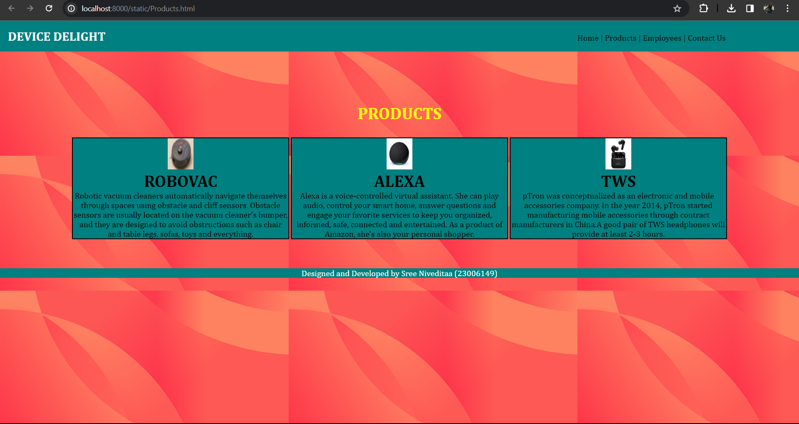
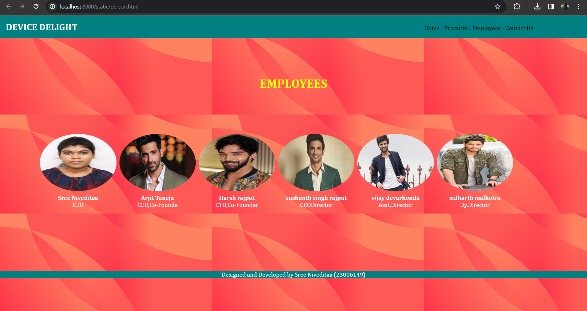

# Web Design for a Software Product Company

## AIM:

To design a static website for a software product company company.

## DESIGN STEPS:

### Step 1:

Requirement collection.

### Step 2:

Creating the layout using HTML and CSS.

### Step 3:

Updating the sample content.

### Step 4:

Choose the appropriate style and color scheme.

### Step 5:

Validate the layout in various browsers.

### Step 6:

Validate the HTML code.

### Step 6:

Publish the website in the given URL.

## PROGRAM :
```
home1.html


<!DOCTYPE html>
<html lang="en">
<head>
    <meta charset="UTF-8">
    <meta name="viewport" content="width=device-width, initial-scale=1.0">
    <title>DD_Home</title>
    <style>
        *{
            margin:0;
            padding:0
        }
        #nav{
            background-color:teal;
            color:white;
            padding: 15px;
    
        }
        li,h1,ul{
            display:inline;
        }
        ul{
            margin-left:60%;
        }
        a{
            color:black;
            text-decoration: none;
        }
        a:hover{
            color:white;
            cursor:pointer;
        }
        input{
            width: 60%;
            padding: 15px;
        }
            .searchbar{
            padding:50px;
            text-align: center;
        }
        
        .box {
            display:inline-block;
            border-style:dotted ;
            border-radius: 10px;
            border-color: yellow;
            width: 400px;
            min-height: 300px;
            font-size: 20px;
            background-color:teal;
        
        }
        .heading1{
            color:black;
            text-align: center;
            padding-top: 20px;
        }
        .heading2{
            color:yellow;
            text-align: justify;
            font-size: 30px;
            margin-left: 30px;
        }
        .edge{
            padding-left: 900px;
        }
        .box{
            text-align: center;
        }
        .bottomdiv{
            background-color:teal;
            color:white;
            text-align: center;
            position:relative;
            display:block;
            margin-top: 72px;

        }
        table{
            margin-left: 40px;
        }
    </style>
</head>
<body background="webcover2.jpg">
    <div class="header">
        <nav id="nav">
            <h1>
                DEVICE DELIGHT
            </h1>
                <ul>
                    <li class="li1"> 
                        <a href="home1.html" target="_blank">Home  |</a>
                    </li>
                    <li class="li2"> 
                        <a href="Products.html" target="_blank">Products  |</a>
                    </li>
                    <li class="li4"> 
                        <a href="person.html" target="_blank">Employees  |</a>
                    </li>
                    <li class="li5"> 
                        <a href="contactus.html" target="_blank">Contact Us</a>
                    </li>
                </ul>
        </nav>
    </div>
    <div class="searchbar">
    <input placeholder="search">
    </div>
        <div><pre class="heading2"><i><b>
"Crafting digital dreams into
tangible gadgets – we transform 
ideas into innovation."<b></i></pre></div>
        <div class="edge">
            <div class="box">
            <h1 class="heading1">LOGIN HERE</h1>
            <br>
            <br>
            <form>
                <table cellpadding="15px" cellspacing="15px">
                    <tr>
                        <td>
                            Username:
                        </td>
                        <td>
                            <input type="email" name="name" placeholder="Enter a Email">
                        </td>
                    </tr>
                    <tr>
                        <td>
                            Password:
                        </td>
                        <td>
                            <input type="password" name="pwd" placeholder="Enter a Password">
                        </td>
                    </tr>
                    <tr>
                        <td colspan="2">
                            <input type="submit" value="LOGIN" style="background-color: black; color:aqua;">
                        </td>
                    </tr>
                </table>
                
            </form>
            </div>
        </div>
    <div class="bottomdiv">
        <p>Designed and Developed by Sree Niveditaa (23006149)</p>
    </div>
</body>
<html>

products.html

<!DOCTYPE html>
<html lang="en">
<head>
    <meta charset="UTF-8">
    <meta name="viewport" content="width=device-width, initial-scale=1.0">
    <title>DD_Products</title>
    <style>
        *{
            margin:0;
            padding:0;
            font-family:Cambria, Cochin, Georgia, Times, 'Times New Roman', serif;
        }
        #nav{
            background-color:teal;
            color:white;
            padding: 15px;
    
        }
        li,.heading1,ul{
            display:inline;
        }
        ul{
            margin-left:60%
        }
        li{
            color:black;
        }
        li:hover{
            color:white;
            cursor:pointer;
        }
        input{
            width: 60%;
            padding: 15px;
        }
            .searchbar{
            padding:50px;
            text-align: center;
        }
        .box{
            border-color:black;
            border-width:2px;
            border-style:solid;
            display: inline-block;
            width: 414px;
        }
        .product{

            text-align: center;
        }
        .box{
            background-color:teal;
            cursor:pointer;
        }
        a{
            color:black;
            text-decoration: none;
        }
        a:hover{
            color:white;
            cursor:pointer;
        }
        .heading2{
            padding-top: 100px;
            padding-bottom: 10px;
            text-align: center;
            color:yellow;
        }
        .bottomdiv{
            background-color:teal;
            color:white;
            text-align: center;
            position:relative;
            display:block;
            margin-top: 56px;

        }
    </style>
</head>
<body background="webcover2.jpg">
    <div class="header">
        <nav id="nav">
            <h1 class="heading1">DEVICE DELIGHT</h1>
                <ul>
                    <li class="li1"> 
                        <a href="home1.html" target="_blank">Home  |</a>
                    </li>
                    <li class="li2"> 
                        <a href="Products.html" target="_blank">Products  |</a>
                    </li>
                    <li class="li4"> 
                        <a href="person.html" target="_blank">Employees  |</a>
                    </li>
                    <li class="li5"> 
                        <a href="contactus.html" target="_blank">Contact Us</a>
                    </li>
                </ul>
            </nav>
        </div>
        <h1 class="heading2">PRODUCTS</h1>
        <br>
        <div class="product">
            <div class="box">
                
                <h1>ROBOVAC</h1>
                <p>Robotic vacuum cleaners automatically navigate themselves through spaces using obstacle and cliff sensors. Obstacle sensors are usually located on the vacuum cleaner's bumper, and they are designed to avoid obstructions such as chair and table legs, sofas, toys and everything.</p>
            </div>
            <div class="box">
                
                <h1>ALEXA</h1>
                <p>Alexa is a voice-controlled virtual assistant. She can play audio, control your smart home, answer questions and engage your favorite services to keep you organized, informed, safe, connected and entertained. As a product of Amazon, she's also your personal shopper.</p>
            </div>
            <div class="box">
                
                <h1>TWS</h1>
                <p>pTron was conceptualized as an electronic and mobile accessories company. In the year 2014, pTron started manufacturing mobile accessories through contract manufacturers in China.A good pair of TWS headphones will provide at least 2-3 hours.</p>
            </div>
        </div>
    </div>
    <div class="bottomdiv">
        <p>Designed and Developed by Sree Niveditaa (23006149)</p>
    </div>
</body>
</html>

person.html
<!DOCTYPE html>
<html lang="en">
<head>
    <meta charset="UTF-8">
    <meta name="viewport" content="width=device-width, initial-scale=1.0">
    <title>DD_Employees</title>
    <style>
        *{
            margin:0;
            padding:0;
            font-family:Cambria, Cochin, Georgia, Times, 'Times New Roman', serif;
        }
        #nav{
            background-color:teal;
            color:white;
            padding: 15px;
    
        }
        li,.heading1,ul{
            display:inline;
        }
        ul{
            margin-left:60%
        }
        li{
            color:black;
        }
        li:hover{
            color:white;
            cursor:pointer;
        }
        input{
            width: 60%;
            padding: 15px;
        }
        a{
            color:black;
            text-decoration: none;
        }
        a:hover{
            color:white;
            cursor:pointer;
        }
        .heading2{
            padding-top: 100px;
            padding-bottom: 10px;
            text-align: center;
            color:yellow;
        }
        .bottomdiv{
            background-color:teal;
            color:white;
            text-align: center;
            position:relative;
            display:block;
            margin-top: 163px;

        }
        img{
            border-radius: 50%;
            width: 200px;
            display: inline;
            padding:3px;
            
        }
        .person{
            margin:100px;
            text-align: center;
        }
        b,p{
            color:white;
            text-align: center;
        }
    </style>
</head>
<body background="webcover2.jpg">
    <div class="header">
        <nav id="nav">
            <h1 class="heading1">DEVICE DELIGHT</h1>
                <ul>
                    <li class="li1"> 
                        <a href="home1.html" target="_blank">Home  |</a>
                    </li>
                    <li class="li2"> 
                        <a href="Products.html" target="_blank">Products  |</a>
                    </li>
                    <li class="li4"> 
                        <a href="person.html" target="_blank">Employees  |</a>
                    </li>
                    <li class="li5"> 
                        <a href="contactus.html" target="_blank">Contact Us</a>
                    </li>
                </ul>
            </nav>
        </div>
        <h1 class="heading2">EMPLOYEES</h1>
        <table class="person">
            <tr>
                <td>
                    
                </td>
                <td>
                    
                </td>
                <td>
                    
                </td>
                <td>
                    
                </td>
                <td>
                    
                </td>
                <td>
                    
                </td>
            </tr>
            <tr>
                <td>
                    <b>Sree Niveditaa</b>
                    <p>CEO</p>
                </td>
                <td>
                    <b>Arjit Taneja</b>
                    <p>CEO,Co-Founde</p>
                </td>
                <td>
                    <b>Harsh rajput</b>
                    <p>CTO,Co-Founder</p>
                </td>
                <td>
                    <b>sushanth singh rajput</b>
                    <p>CEODirector</p>
                </td>
                <td>
                    <b>vijay devarkonda</b>
                    <p>Asst.Director</p>
                </td>
                <td>
                    <b>sidharth malhotra</b>
                    <p>Dy.Director</p>
                </td>
            </tr>
        </table>
    </div>
    <div class="bottomdiv">
        <p>Designed and Developed by Sree Niveditaa (23006149)</p>
    </div>
</body>
</html>

contactus.html
<!DOCTYPE html>
<html lang="en">
<head>
    <meta charset="UTF-8">
    <meta name="viewport" content="width=device-width, initial-scale=1.0">
    <title>DD_Contactus</title>
    <style>
        *{
            margin:0;
            padding:0;
            font-family:Cambria, Cochin, Georgia, Times, 'Times New Roman', serif;
        }
        #nav{
            background-color:teal;
            color:white;
            padding: 15px;
    
        }
        li,.heading1,ul{
            display:inline;
        }
        ul{
            margin-left:60%
        }
        li{
            color:black;
        }
        li:hover{
            color:white;
            cursor:pointer;
        }
        input{
            width: 60%;
            padding: 15px;
        }
            .searchbar{
            padding:50px;
            text-align: center;
        }
        .box{
            border-color:black;
            border-width:2px;
            border-style:solid;
            display: inline-block;
            width: 414px;
        }
        .product{

            text-align: center;
        }
        .box{
            background-color:teal;
            cursor:pointer;
        }
        a{
            color:black;
            text-decoration: none;
        }
        a:hover{
            color:white;
            cursor:pointer;
        }
        .heading2{
            padding-top: 100px;
            padding-bottom: 10px;
            text-align: center;
            color: yellow;
        }
        .table1{
            color:white;
            font-size: large;
        }
        .contactus{
            margin-left:400px;
        }
        .heading3{
            padding-top: 30px;
            padding-bottom: 10px;
            text-align: center;
            color: yellow;
        }
        .table2{
            color:white;
            font-size: large;
            background-color:rgb(95, 92, 92);
            border-radius: 5px;
            border-style:dotted;
            border-color: yellow;

        }
        .queries{
            margin-left:600px;
        }
        .bottomdiv{
            background-color:teal;
            color:white;
            text-align: center;
            position:relative;
            display:block;
            margin-top: 24px;

        }
    </style>
</head>
<body background="webcover2.jpg">
    <div class="header">
        <nav id="nav">
            <h1 class="heading1">DEVICE DELIGHT</h1>
                <ul>
                    <li class="li1"> 
                        <a href="home1.html" target="_blank">Home  |</a>
                    </li>
                    <li class="li2"> 
                        <a href="Products.html" target="_blank">Products  |</a>
                    </li>
                    <li class="li4"> 
                        <a href="person.html" target="_blank">Employees  |</a>
                    </li>
                    <li class="li5"> 
                        <a href="contactus.html" target="_blank">Contact Us</a>
                    </li>
                </ul>
            </nav>
        </div>
        <h1 class="heading2">CONTACT US</h1>
        <div class="contactus">
            <table cellpadding="15px" cellspacing="15px" class="table1">
                <tr>
                    <td>
                        ADDRESS :
                    </td>
                    <td>
                        22A , solai main street, Ayanavaram,chennai- 23
                    </td>
                </tr>
                <tr>
                    <td>
                        LANDMARK :
                    </td>
                    <td>
                        near solai amman temple
                    </td>
                </tr>
                <tr>
                    <td>
                        Email :
                    </td>
                    <td>
                        devicedelight@gmail.com
                    </td>
                </tr>
                <tr>
                    <td>
                        PHONE :
                    </td>
                    <td>
                        9600156703
                    </td>
                </tr>
            </table>
        </div>
        <div>
            <h3 class="heading3">QUERIES</h3>
            <div class="queries">
                <table cellpadding="15px" cellspacing="15px" class="table2">
                    <tr>
                        <td>
                            NAME :
                        </td>
                        <td>
                            <input type="name" placeholder="Enter your name"> 
                        </td>
                    </tr>
                    <tr>
                        <td>
                            EMAIL :
                        </td>
                        <td>
                            <input type="email" placeholder="Enter your E-mail">
                        </td>
                    </tr>
                    <tr>
                        <td>
                            MESSAGE :
                        </td>
                        <td>
                            <input type="text" placeholder="Enter your text">
                        </td>
                    </tr>
                    <tr>
                        <td colspan="2">
                            <input type="submit" style="background-color: lightskyblue; color: black;">
                        </td>
                    </tr>
            </table>
        </div>
        <div class="bottomdiv">
            <p>Designed and Developed by Sree Niveditaa (23006149)</p>
        </div>
    </div>
</body>
</html>


```
## OUTPUT:

### Home Page:


### Products:


### Employees:


### Contact Us:


## Result:

Thus a website is designed for the software product company and the HTML,CSS code are validated.
